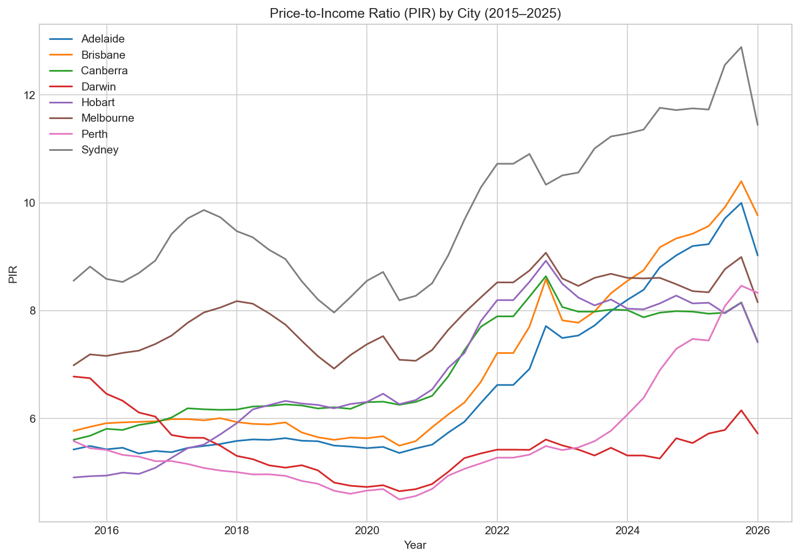
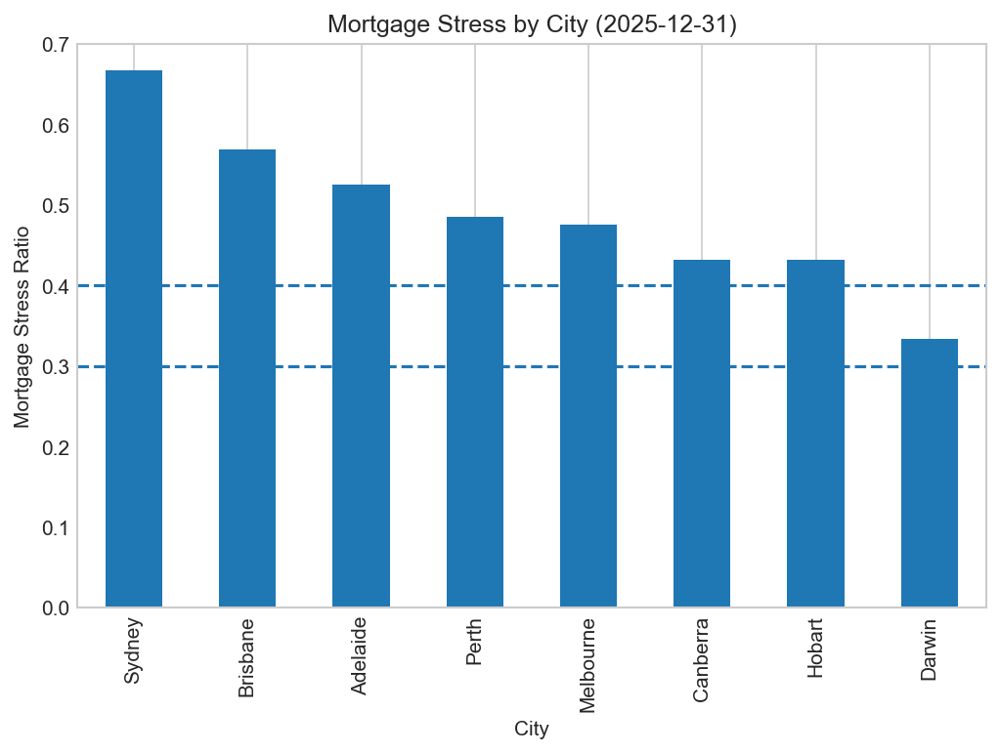
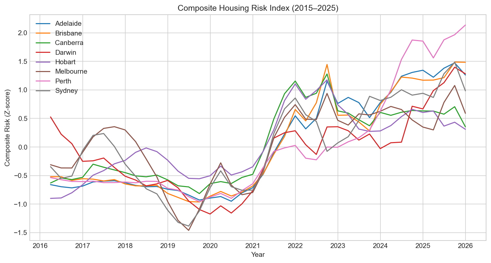

# Australian Housing Affordability Risk Analytics (2015-2025)


---

## Project Overview

A comprehensive data analytics project examining housing affordability across Australian capital cities from 2015 to 2025. Combines multiple economic datasets to assess affordability risk through Price-to-Income Ratios, mortgage stress analysis, and composite risk modeling.

**Key Finding:** All Australian capital cities exceed international "seriously unaffordable" thresholds, with Brisbane and Adelaide experiencing the fastest deterioration (+66-69% PIR increase), signaling a systemic crisis spreading beyond traditional hot markets.

---

## Business Questions

- Are housing prices diverging from wage growth across Australian cities?
- How has mortgage stress evolved over time, particularly after the 2022-2023 RBA rate hikes?
- Which cities exhibit the highest structural housing risk?
- What are the implications for banks, government, and first-home buyers?

---

##  Key Findings

### **1. Universal Affordability Crisis**
All capital cities exceed "seriously unaffordable" threshold (PIR >4.1×):
- **Sydney:** 11.4× PIR (14.3 years to save deposit)
- **Brisbane:** 9.8× PIR (+69% since 2015) 
- **Adelaide:** 9.0× PIR (+67% since 2015) 
- **Melbourne:** 8.2× PIR

### **2. Severe Mortgage Stress**
Median households face mortgage payments consuming **48-67% of gross income**—well above APRA's 30% prudential threshold:
- Sydney: 66.7% (2.2× APRA limit)
- Brisbane: 56.9% (1.9× APRA limit)
- Adelaide: 52.6% (1.8× APRA limit)

### **3. Structural Supply-Demand Imbalance**
- Housing supply: +1.2% annually
- Population growth: +1.6% annually
- Wage growth: +0.8% annually vs Price growth: +5.3% annually
- **Gap widens 4.5 percentage points per year**

### **4. Policy Failures**
Demand-side interventions (First Home Owner Grant, negative gearing) inflate prices without addressing supply constraints. Evidence-based solution: upzone transit corridors, streamline approvals, expand public housing.

---

## Technical Approach

### **Data Sources**
| Source | Description | Coverage |
|--------|-------------|----------|
| [**ABS RPPI**](https://www.abs.gov.au/statistics/economy/price-indexes-and-inflation/residential-property-price-indexes-eight-capital-cities) | Residential Property Price Index | 2003-2021 (quarterly) |
| [**PropTrack**](https://www.proptrack.com.au/research) | Median housing prices | 2022-2025 (quarterly) |
| [**ABS AWE**](https://www.abs.gov.au/statistics/labour/earnings-and-working-conditions/average-weekly-earnings-australia) | Average Weekly Earnings by state | 2015-2025 | 
| [**RBA**](https://www.rba.gov.au/statistics/cash-rate/) | Cash rate (monetary policy) | 2015-2025 |
| [**ABS WPI**]((https://www.abs.gov.au/statistics/economy/price-indexes-and-inflation/wage-price-index-australia)) | Wage Price Index | 2015-2025 |

### **Data Engineering**
- **Hybrid dataset construction:** Bridged ABS (2015-2021) and PropTrack (2022-2025) using 2022 Q1 anchor point
- **City-level panel data:** 352 observations (8 cities × 44 quarters)
- **State-to-city income mapping:** AWE state data mapped to capital cities (standard practice)
- **Quarterly frequency alignment:** Consistent temporal granularity across all sources

### **Analytical Metrics**

**Price-to-Income Ratio (PIR):**
```python
PIR = Median_Price / Annual_Income
# Benchmark: 3× = affordable, >5× = severely unaffordable
```

**Mortgage Stress:**
```python
# Proper amortization formula (30-year loan, 20% deposit)
Quarterly_Payment = P × (r × (1+r)^n) / ((1+r)^n - 1)
Mortgage_Stress = Annual_Repayment / Annual_Income
# APRA threshold: 30%
```

**Composite Housing Risk Index:**
```python
# Equal-weighted z-score normalization
Risk_Score = 0.33 × PIR_z + 0.33 × Stress_z + 0.33 × GrowthGap_z
# Classification: High Risk (>70), Moderate (40-70), Low (<40)
```

---

## Visualizations

The analysis includes 10+ visualizations:
- Price Index Trends (2015-2025)
- Mortgage Stress Rankings
- Wage vs Housing Growth Divergence
- Composite Risk Score Comparison

### **Sample Outputs:**

#### 1. Price-to-Income Ratio by City (2015-2025)

*All Australian capital cities exceed "seriously unaffordable" threshold (PIR >4.1×). Sydney leads at 11.4×, requiring 14+ years to save a deposit.*

---

#### 2. Mortgage Stress: Latest Quarter Rankings

*Median households face mortgage payments consuming 48-67% of gross income—well above APRA's 30% prudential threshold. Sydney shows severe stress at 66.7%.*

---

#### 3. Composite Housing Risk Index Timeline

*Risk trajectories show Brisbane and Adelaide experiencing rapid deterioration since 2020, converging toward Sydney/Melbourne crisis levels.*

---

#### 4. Wage vs Housing Growth Divergence
.png)
*Housing prices consistently outpace wage growth by 4-5 percentage points annually, creating a structural affordability gap that widens over time.*

---

## Business Implications

### **For Banks**
- **Risk:** Loan-to-income ratios at 6-10× create elevated default risk
- **Action:** Tighten lending standards, stress test portfolios at 7%+ rates
- **Opportunity:** Shared equity products, longer-term mortgages (40-year)

### **For Government**
- **Failure:** Demand-side policies (FHOG) inflate prices without improving access
- **Solution:** Supply-side reform—upzone transit corridors (+15K units/year), streamline approvals (18 months → 3 months), expand public housing (Singapore HDB model)
- **ROI:** ~5× if policies reduce PIR by 20-30%

### **For First-Home Buyers**
- **Location arbitrage:** Adelaide ($908K) vs Sydney ($1.24M) = $332K savings
- **Alternative pathways:** Shared equity (reduce deposit 40%), interstate relocation, rentvesting
- **Timing:** Rate stabilization expected 2026-2027

---

## Methodology Highlights

**Data Bridging (2021-2022 Gap):**
- ABS RPPI ends Dec 2021; PropTrack begins Mar 2022
- Extended RPPI to 2022 Q1 using PropTrack quarterly growth rate
- Calculated conversion factor at 2022 Q1 anchor point
- Back-calculated historical prices (2015-2021) using RPPI × conversion factor
- Validated against ABS March 2022 mean prices

**Limitations:**
- Median prices back-calculated from index (±5% accuracy)
- State-level income mapped to cities (approximation)
- Simplified mortgage model (standard 30-year, 20% deposit assumptions)
- Capital cities only (regional markets excluded)

---

## How to Run

**Requirements:**
```bash
pip install pandas numpy matplotlib seaborn scipy openpyxl
```

**Execution:**
```bash
# Clone repository
git clone https://github.com/CrypticPh0enix/australian-housing-affordability.git

# Open Jupyter Notebook
jupyter notebook australian-housing-affordability.ipynb

# Run all cells (Kernel > Restart & Run All)
```

---

## Repository Structure
```
australian-housing-affordability/
│
├── australian-housing-affordability.ipynb   
├── README.md                                  
├── requirements.txt                         
├── .gitignore                               
│
├── data/                                    
│   ├── abs_rppi_2003_2021.csv
│   ├── AWE_by_state.csv
│   ├── WPI_by_state.csv
│   ├── cash_rate.csv
│   └── proptrack_2022_2025.csv
│
└── images/                                 
    ├── median_housing_price_by_city.png
    ├── annual_income_by_city.png
    ├── PIR_by_city.png
    ├── housing_vs_wage_growth_gap(YoY).png
    ├── avg_growth_gap_by_city.png
    ├── post_covid_avg_growth_gap.png
    ├── mortgage_stress_ratio_by_city.png
    ├── latest_quarter_mortgage_stress_by_city.png
    ├── high_mortgage_stress_quarters_by_city.png
    ├── avg_mortgage_stress_by_city.png
    ├── mortgage_stress_vs_growth_gap_sydney.png
    ├── mortgage_stress_vs_growth_gap.png
    ├── interest_rates_vs_mortgage_stress.png
    ├──latest_quarter_composite_housing_risk_by_city.png
    ├── composite_housing_risk_index_timeline.png
    ├── avg_composite_housing_risk_by_city.png
    └── housing_risk_correlation_heatmap.png
```

**Note:** Raw data files not included due to size/licensing. See Data Sources section for links.

---

## Skills Demonstrated

- **Data Engineering:** Multi-source integration, data harmonization, bridging methodologies
- **Statistical Analysis:** Z-score normalization, composite index construction, time series analysis
- **Financial Modeling:** Mortgage amortization, affordability metrics, stress testing
- **Business Communication:** Stakeholder-specific insights, evidence-based recommendations
- **Technical Proficiency:** Python (Pandas, NumPy, Matplotlib, Seaborn), Jupyter Notebooks

---

## Author

**Roja Joshi**  
Data Analyst | Bachelor of Data Science (Advanced) 

📧 [rojajoshi37@gmail.com](mailto:rojajoshi37@gmail.com)  
💼 [LinkedIn](https://www.linkedin.com/in/roja-joshi-927354267/)  
🔗 [GitHub](https://github.com/CrypticPh0enix)

---

## Acknowledgments

- **Australian Bureau of Statistics (ABS)** - RPPI and AWE data
- **Reserve Bank of Australia (RBA)** - Cash rate data
- **PropTrack (REA Group)** - Median price data (manually extracted from quarterly reports)
- **Demographia International Housing Affordability** - PIR benchmarks

---